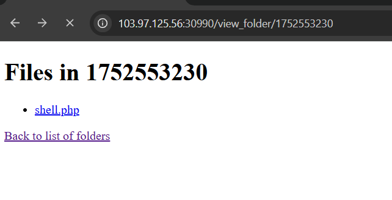
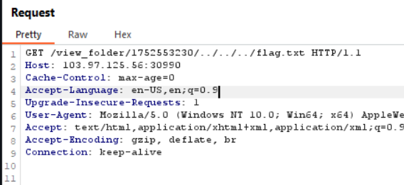

# cookiearena - Unzip me now

## 15/7/2025 

### Đề

Upload a zip file, the system will be extract to you.

- **Flag is located on** `/flag.txt`
- **Format FLAG: CHH{XXX}**

### Giải:

Đầu tiên cứ vào web trước.

Như đề đã nêu trên, ta sẽ upload file zip để xem thử có gì.

Thử truy cập vào folder `1752553230`.

Ta thấy ở đây web đã giải nén file zip mình đã upload lên trước đó và hiện ra file `shell.php`, vậy thì ta sẽ thử đọc thử `flag.txt` xem thử được không.

Mình nghĩ folder của challenges sẽ là `challenges/view_folder/1752553230` và file `flag.txt` sẽ cùng cấp với folder challenges nên mình thử dùng burp suite với lệnh get để back ra khỏi 3 folder:

**Kết quả:**

